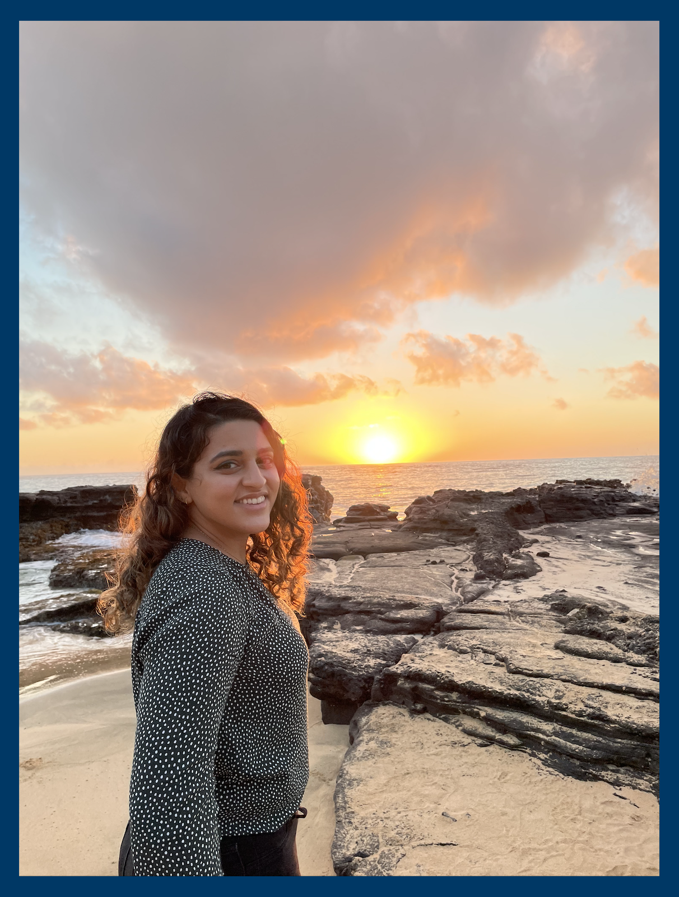

 

 

### Background

I grew up in Brooklyn, New York and received my BS in Biology and BA in Chemistry from the [University at Albany, State University of New York](http://www.albany.edu/) in 2015. Throughout my undergraduate studies, I volunteered as an Emergency Medical Technician (EMT-B) and CPR instructor, while also conducting research in my spare time. 
My research in the biodistribution of nanoparticles in rat models sparked an interest in public health. Continuing my studies, I earned a Master’s in Public Health (MPH) with a concentration in Environmental Health from the [University at Albany School of Public Health](http://www.albany.edu/sph/) in 2017. During my MPH program, I studied the nutrient transition in Peru due to exposure to a Western diet as well as nutrient and contaminant levels of farmed and wild salmon. 

At [Columbia University's Mailman School of Public Health](https://www.mailman.columbia.edu/), I hope to expand my knowledge of environmental exposures and related health outcomes in historically underrepresented groups.

 

#### Curriculum Vitae

My CV can be accessed [here](Downloads/AKA_CV.pdf).

 

#### Contact Information

Ahlam Abuawad
[Department of Environmental Health Sciences](https://www.mailman.columbia.edu/become-student/departments/environmental-health-sciences-ehs)  
[Columbia Mailman School of Public Health](http://www.mailman.columbia.edu/)  
722 West 168th Street  
New York, New York 10032  

Email: [aka2170@cumc.columbia.edu](mailto:aka2170@cumc.columbia.edu)  

