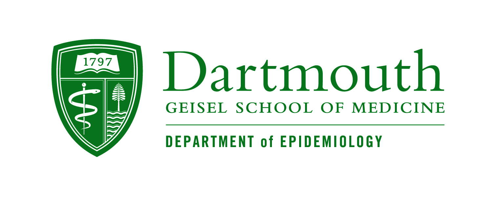

 
 

# **Ahlam Abuawad**
## Postdoctoral Fellow

 

#### [Geisel School of Medicine at Dartmouth, Department of Epidemiology](https://geiselmed.dartmouth.edu/epidemiology/)
 
 
 
 
 
 

## Biography 

Ahlam received a BS in Biology and a BA in Chemistry from the [University at Albany, State University of New York](http://www.albany.edu/) in 2015. Throughout her undergraduate studies, Ahlam volunteered as an Emergency Medical Technician (EMT-B) and CPR instructor for [Five Quad Volunteer Ambulance Service](https://www.albany.edu/five-quad), while also conducting research in her spare time.

 

Ahlam's research on the biodistribution of nanoparticles in rat models sparked her interest in public health. Continuing her studies, Ahlam earned a Master of Public Health (MPH) with a concentration in Environmental Health from the [University at Albany School of Public Health](http://www.albany.edu/sph/) in 2017. During her MPH program, Ahlam studied the nutrient transition in Peru due to exposure to a Western diet as well as nutrient and contaminant levels of farmed and wild salmon. 

 

At [Columbia University's Mailman School of Public Health](https://www.mailman.columbia.edu/), Ahlam expanded her knowledge of environmental exposures, nutrition, and metabolic health outcomes in Bangladeshi and American Indian populations. Ahlam earned her Master of Philosophy (MPhil) and Doctor of Philosophy (PhD) in Environmental Health Sciences in 2020 and 2022, respectively. 

 

Ahlam is currently a postdoctoral fellow at the [Geisel School of Medicine at Dartmouth](https://geiselmed.dartmouth.edu/) researching arsenic exposure, metabolomics, and metabolic health outcomes in early life exposures. 

 

Ahlam's CV can be accessed [here](Downloads/AKA_CV.pdf).

 
 
 

### <i class="far fa-address-card fa-lg"></i>

Ahlam Abuawad
 
[Department of Epidemiology](https://geiselmed.dartmouth.edu/epidemiology/)  
[Geisel School of Medicine at Dartmouth](https://geiselmed.dartmouth.edu/) 
 
1 Medical Center Drive  
DHMC | Lebanon, NH 03756
 
Email: [ahlam.k.abuawad@dartmouth.edu](mailto:ahlam.k.abuawad@dartmouth.edu)  

